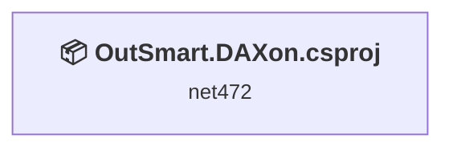
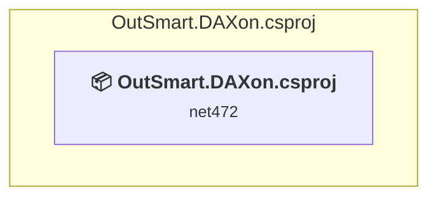

# Projects and dependencies analysis

This document provides a comprehensive overview of the projects and their dependencies in the context of upgrading to .NETCoreApp,Version=v10.0.

## Table of Contents

- [Executive Summary](#executive-Summary)
  - [Highlevel Metrics](#highlevel-metrics)
  - [Projects Compatibility](#projects-compatibility)
  - [Package Compatibility](#package-compatibility)
  - [API Compatibility](#api-compatibility)
  - [Binding Redirect Configuration](#binding-redirect-configuration)
- [Aggregate NuGet packages details](#aggregate-nuget-packages-details)
- [Top API Migration Challenges](#top-api-migration-challenges)
  - [Technologies and Features](#technologies-and-features)
  - [Most Frequent API Issues](#most-frequent-api-issues)
- [Projects Relationship Graph](#projects-relationship-graph)
- [Project Details](#project-details)

  - [OutSmart.DAXon.csproj](#outsmartdaxoncsproj)

## Executive Summary

### Highlevel Metrics

| Metric | Count | Status |
| :--- | :---: | :--- |
| Total Projects | 1 | All require upgrade |
| Total NuGet Packages | 0 | All compatible |
| Total Code Files | 1530 |  |
| Total Code Files with Incidents | 44 |  |
| Total Lines of Code | 298011 |  |
| Total Number of Issues | 584 |  |
| Estimated LOC to modify | 582+ | at least 0,2% of codebase |

### Projects Compatibility

| Project | Target Framework | Difficulty | Package Issues | API Issues | Binding Issues | Est. LOC Impact | Description |
| :--- | :---: | :---: | :---: | :---: | :---: | :---: | :--- |
| [OutSmart.DAXon.csproj](#outsmartdaxoncsproj) | net472 | 🟢 Low | 1 | 582 | 0 | 582+ | ClassLibrary, Sdk Style = True |

### Package Compatibility

| Status | Count | Percentage |
| :--- | :---: | :---: |
| ✅ Compatible | 0 | 0,0% |
| ⚠️ Incompatible | 0 | 0,0% |
| 🔄 Upgrade Recommended | 0 | 0,0% |
| ***Total NuGet Packages*** | ***0*** | ***100%*** |

### API Compatibility

| Category | Count | Impact |
| :--- | :---: | :--- |
| 🔴 Binary Incompatible | 1 | High - Require code changes |
| 🟡 Source Incompatible | 414 | Medium - Needs re-compilation and potential conflicting API error fixing |
| 🔵 Behavioral change | 167 | Low - Behavioral changes that may require testing at runtime |
| ✅ Compatible | 102049 |  |
| ***Total APIs Analyzed*** | ***102631*** |  |

## Aggregate NuGet packages details

| Package | Current Version | Suggested Version | Projects | Description |
| :--- | :---: | :---: | :--- | :--- |

## Top API Migration Challenges

### Technologies and Features

| Technology | Issues | Percentage | Migration Path |
| :--- | :---: | :---: | :--- |

### Most Frequent API Issues

| API | Count | Percentage | Category |
| :--- | :---: | :---: | :--- |
| T:System.Numerics.BigInteger | 412 | 70,8% | Source Incompatible |
| T:System.Uri | 118 | 20,3% | Behavioral Change |
| M:System.Uri.#ctor(System.String) | 22 | 3,8% | Behavioral Change |
| P:System.Uri.AbsoluteUri | 13 | 2,2% | Behavioral Change |
| M:System.Uri.#ctor(System.String,System.UriKind) | 4 | 0,7% | Behavioral Change |
| M:System.Uri.#ctor(System.Uri,System.String) | 4 | 0,7% | Behavioral Change |
| P:System.Uri.AbsolutePath | 2 | 0,3% | Behavioral Change |
| P:System.IO.DirectoryInfo.FullName | 1 | 0,2% | Binary Incompatible |
| M:System.TimeSpan.FromMinutes(System.Double) | 1 | 0,2% | Source Incompatible |
| M:System.Uri.#ctor(System.Uri,System.Uri) | 1 | 0,2% | Behavioral Change |
| P:System.Uri.PathAndQuery | 1 | 0,2% | Behavioral Change |
| M:System.Net.WebRequest.Create(System.Uri) | 1 | 0,2% | Source Incompatible |
| M:System.Uri.TryCreate(System.String,System.UriKind,System.Uri@) | 1 | 0,2% | Behavioral Change |
| M:System.Uri.TryCreate(System.Uri,System.String,System.Uri@) | 1 | 0,2% | Behavioral Change |

## Projects Relationship Graph

Legend:
📦 SDK-style project
⚙️ Classic project

## Project Details

### OutSmart.DAXon.csproj

#### Project Info

- **Current Target Framework:** net472
- **Proposed Target Framework:** net10.0
- **SDK-style**: True
- **Project Kind:** ClassLibrary
- **Dependencies**: 0
- **Dependants**: 0
- **Number of Files**: 1533
- **Number of Files with Incidents**: 44
- **Lines of Code**: 298011
- **Estimated LOC to modify**: 582+ (at least 0,2% of the project)

#### Dependency Graph

Legend:
📦 SDK-style project
⚙️ Classic project

### API Compatibility

| Category | Count | Impact |
| :--- | :---: | :--- |
| 🔴 Binary Incompatible | 1 | High - Require code changes |
| 🟡 Source Incompatible | 414 | Medium - Needs re-compilation and potential conflicting API error fixing |
| 🔵 Behavioral change | 167 | Low - Behavioral changes that may require testing at runtime |
| ✅ Compatible | 102049 |  |
| ***Total APIs Analyzed*** | ***102631*** |  |

